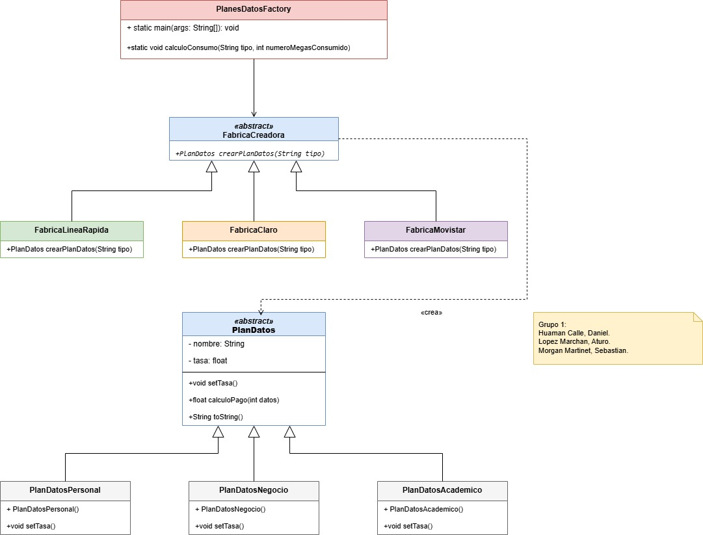
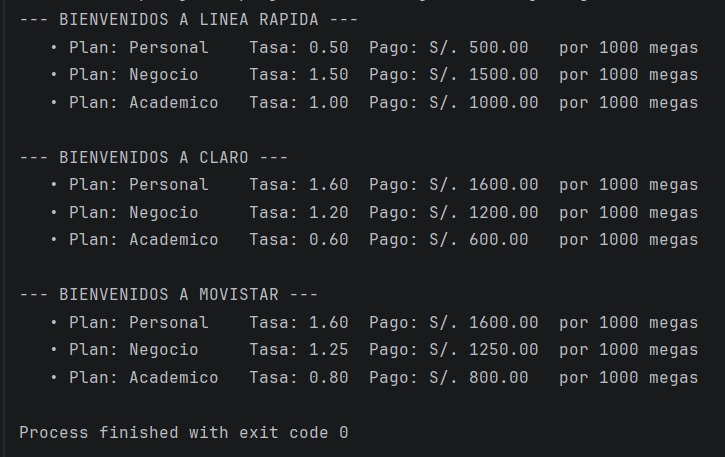

# Sistema con Patrón Factory Method

Este proyecto implementa un sistema para calcular el consumo y pago de planes de datos móviles utilizando el patrón de diseño creacional **Factory Method**. El diseño permite desacoplar la creación de los planes concretos de la lógica de evaluación del cliente.

## Diagrama de Clases UML

A continuación se detalla la arquitectura del sistema basada en el patrón Factory Method, donde las fábricas inyectan dinámicamente las tasas requeridas a las subclases de producto:

## Modificaciones y Decisiones de Diseño

Para optimizar el diseño original y cumplir con los requerimientos precisos del problema, se aplicaron los siguientes cambios clave:

1. **Inyección Dinámica de Tasas (Optimización de Productos):**  
   En lugar de crear subclases de productos duplicadas por cada operador (ej. `PlanAcademicoClaro`, `PlanAcademicoMovistar`), se mantuvieron únicamente tres productos globales: `PlanDatosPersonal`, `PlanDatosNegocio` y `PlanDatosAcademico`. Las tarifas específicas se asignan dinámicamente en tiempo de ejecución mediante el método `setTasa()`.

2. **Responsabilidad de los Creadores Concretos:**  
   Las clases `FabricaClaro`, `FabricaMovistar` y `FabricaLineaRapida` encapsulan de forma independiente las reglas de negocio e inyectan el precio exacto por mega solicitado para cada operador en el método `crearPlanDatos(String tipo)`.

3. **Formateo de Precisión de Punto Flotante:**  
   Se corrigió la imprecisión nativa de las operaciones con tipos `float` (evitando salidas anómalas como `60.000004`) aplicando un formateo estricto a **dos decimales** (`%.2f`) tanto en la tasa como en el costo final acumulado.

4. **Estandarización de Pruebas:**  
   Se unificó la evaluación de consumo a **1000 megas** para todos los operadores en el método `main`, permitiendo realizar una comparativa visual directa y equitativa de los costos entre los tres proveedores.

## Ejecución y Resultados en Consola

El sistema genera un reporte limpio y alineado por columnas para facilitar la lectura del usuario.

### Captura del Resultado del Main:
